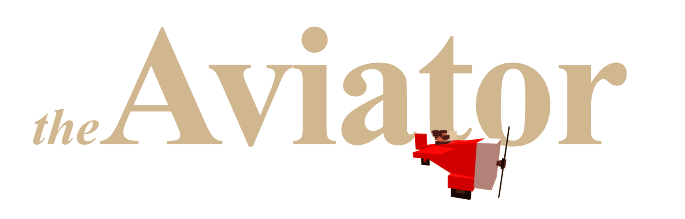

    

# The Game 🎮

**Do you like challenges? Play a `coding Game` that test your `skills` in creating algorithms. The proposed challenges have different difficulty levels, which make the game suitable for both beginner and experienced programmers.**

**What are you waiting for? Test yourself and challenge friends and colleagues 😎.**

- **[Online Game](https://paol-imi.github.io/the-aviator/)**
- **[Tutorial](https://paol-imi.github.io/the-aviator/tutorial/#/)**

    

 

**As a computer engineering student and creator of this project, I would recommend tools like this as `educational`👨‍🎓 support in schools and universities. Thanks to targeted design choices and an advanced code debugging system _(with time travel)_, The Game tries to provide the best developer experience and guide the student's `reasoning` in each challenge.**

 

# Worlds 🌍

- ## `BEGINNERS' FOREST` 🌲 - Designed for beginners
- ## `PROGRAMMERS' FARM` 🚜 - Designed for beginners
- ## `RECURSIVE VOLCANO` 🌋 - Designed for advanced students and teachers
- ## `IMPOSSIBLE OCEAN` 🐳 - Not even teachers can solve this😎

 

# Built with 🛠️

**This Game is built on [Blockly](https://github.com/google/blockly) using [blockly-gamepad](https://github.com/paol-imi/blockly-gamepad)**.

 

# Special thanks 🤝

- **Amazing Aviator sprite made by [Karim Maaloul](https://tympanus.net/codrops/2016/04/26/the-aviator-animating-basic-3d-scene-threejs/)**  
- **Gamepad icon made by [Smashicons](https://www.flaticon.com/authors/smashicons) from [www.flaticon.com](https://www.flaticon.com) is licensed by [CC 3.0 BY](http://creativecommons.org/licenses/by/3.0)**
